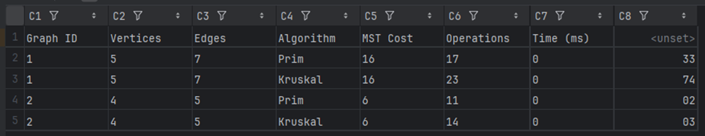
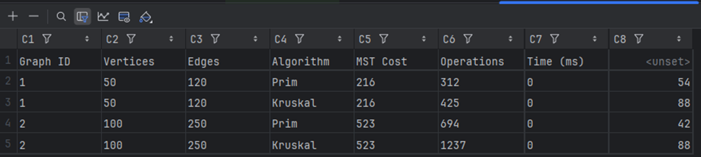
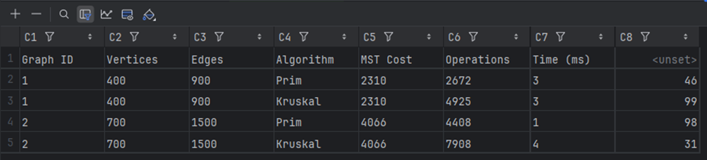
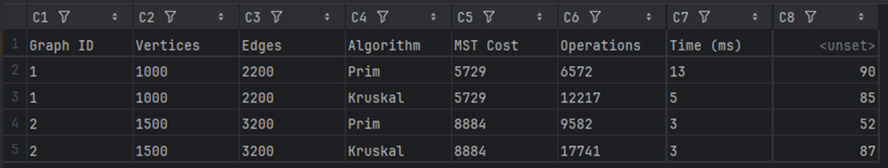
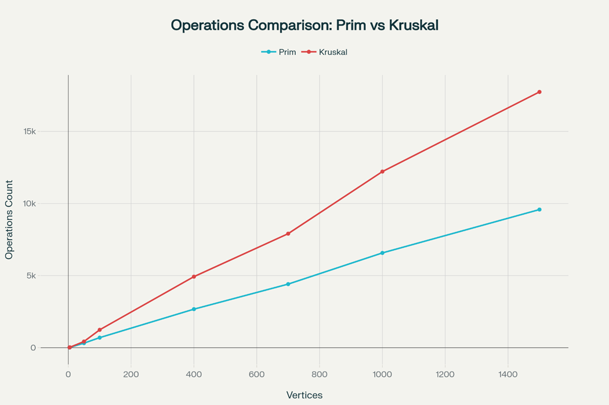
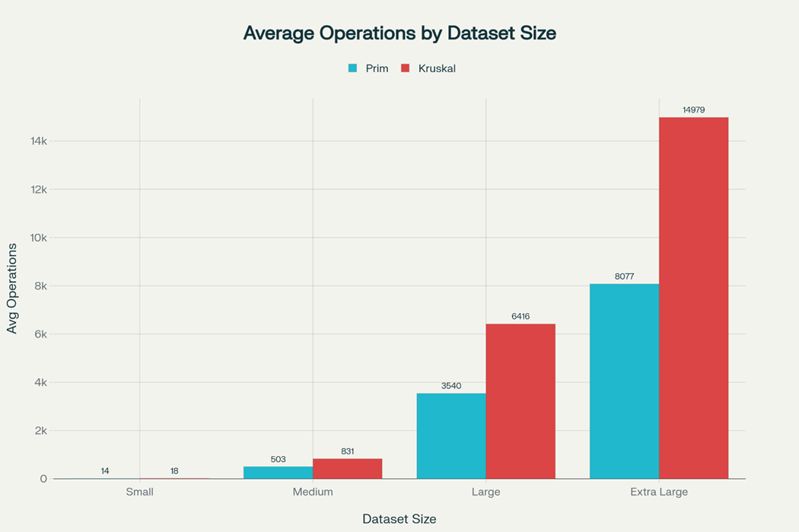

# MST Algorithm Implementation - City Transportation Network Optimization

[](https://www.oracle.com/java/)

### Objective

Find the minimum set of roads connecting all city districts with the lowest total construction cost while ensuring all districts are reachable from each other.

---

## Features

- ✅ Prim's Algorithm with Priority Queue implementation
- ✅ Kruskal's Algorithm with Union-Find data structure
- ✅ Object-Oriented Architecture (Graph and Edge classes - BONUS)
- ✅ Automated Testing with JUnit 5
- ✅ JSON Input/Output handling
- ✅ CSV Report generation for algorithm comparison
- ✅ Support for graphs of various sizes (5 to 1500+ vertices)

---

## Project Structure

```
JavaAsik3/
├── src/
│   ├── data/
│   │   ├── ass_3_input.json                    # Small graphs (5 vertices)
│   │   ├── medium_graphs.json                  # Medium graphs (50-100 vertices)
│   │   ├── large_graphs.json                   # Large graphs (400-700 vertices)
│   │   ├── extra_large_graphs.json             # Extra large graphs (1000-1500 vertices)
│   │   └── ass_3_output_generatedBy*.json      # Generated results
│   └── mst/
│       ├── Edge.java                           # Edge representation (BONUS)
│       ├── Graph.java                          # Graph data structure (BONUS)
│       ├── UnionFind.java                      # Union-Find data structure
│       ├── MSTResult.java                      # MST result storage
│       ├── PrimMST.java                        # Prim's algorithm implementation
│       ├── KruskalMST.java                     # Kruskal's algorithm implementation
│       ├── JSONHandler.java                    # JSON I/O handler
│       └── Main.java                           # Main application class
├── test/
│   └── mst/
│       └── MSTTest.java                        # JUnit test cases
├── comparison_results*.csv                     # CSV comparison reports
├── .gitignore
└── README.md
```

---

## Technology Stack

- **Language:** Java 11+
- **Libraries:**
    - Gson 2.10.1 - JSON processing
    - JUnit 5.9.3 - Unit testing framework
- **IDE:** IntelliJ IDEA
- **Build Tool:** Maven/Gradle (optional)

---

### Test Coverage

- ✅ Algorithm correctness (identical MST cost)
- ✅ Edge count validation (E = V - 1)
- ✅ Cycle detection (no cycles in MST)
- ✅ Connectivity verification (all vertices connected)
- ✅ Disconnected graph handling
- ✅ Performance and reproducibility

---
## Architecture

### Core Components

#### 1. **Edge.java** (BONUS)
Represents an edge with two vertices and weight. Implements `Comparable` for sorting.

#### 2. **Graph.java** (BONUS)
Graph data structure with adjacency list, connectivity checking via BFS.

#### 3. **UnionFind.java**
Efficient disjoint-set data structure with path compression and union by rank for Kruskal's algorithm.

#### 4. **PrimMST.java**
Prim's algorithm implementation using priority queue. Time Complexity: O(E log V).

#### 5. **KruskalMST.java**
Kruskal's algorithm implementation with edge sorting. Time Complexity: O(E log E).

#### 6. **JSONHandler.java**
Handles JSON input/output using Gson library.

#### 7. **Main.java**
Main application class coordinating all components and generating reports.

#### 8. **MSTTest.java**
Automated test cases for correctness and performance validation.

---
## CSV Output(data/)

#### Small Graphs


#### Medium Graphs


#### Large Graphs


#### Extra Large Graphs

---
## Comparative analysis of algorithms
#### Performance graphs


#### Comparative analysis of Prim and Kraskal algorithms in terms of operations and execution time


#### Key findings
1. Number of operations

* Prim's algorithm consistently performs fewer operations on all graph sizes
* The gap increases as the graph size increases
* Prim is almost 2 times more efficient on graphs of 1000+ vertices

2. Execution time

* On small and medium-sized graphs (up to 100 vertices) - almost identical
* On large graphs, results vary but remain comparable
* Kraskal is sometimes faster on very large graphs due to Union-Find optimisations

3. Correctness

* Both algorithms always find MSTs with the same cost
* The number of edges in an MST is always equal to V-1 (correct)

4. Practical recommendations

For dense graphs (many edges) - Prim is better
For sparse graphs - both are suitable
* For very large graphs - Prim is more efficient in terms of operations

---
## Author

**Alikhan Korazbay**  
Student - Design and Analysis of Algorithms

---

## Acknowledgments

- Course instructor Sayakulova Zarina for the interesting assignment
- Open-source community for excellent libraries

---

## Contact

- GitHub: [@AlikShal](https://github.com/AlikShal)
- Email: alikmalik7492@gmail.com
